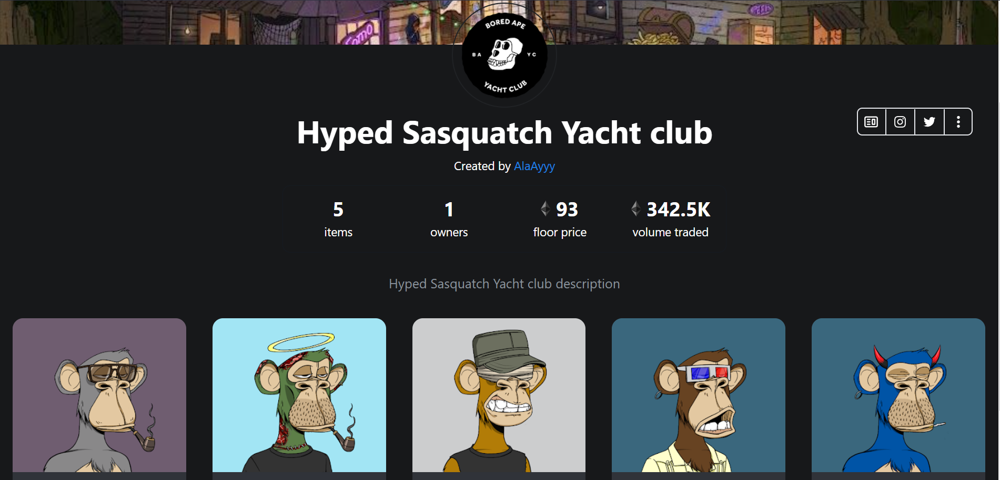
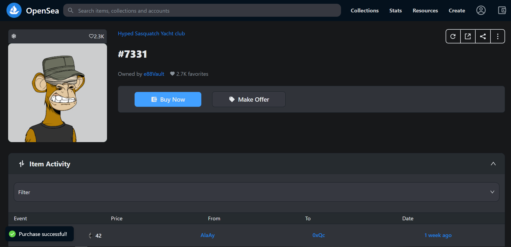

# Opensea Clone using #NextJs #Tailwind  #ThirwebSDK 

This is a personnal project [Tailwind CSS](https://tailwindcss.com/) with Next.js.
This project was made using #NextJs #Tailwind #ThirwebSDK #SanityIO

It includes a landing page and collection page listed on Georly Test network fetched from ThirdWeb marketplace module and NFT collection module.
Authentication is established with metamask.
## NFT Listing on Goerli testnet.

> Implementation







## Instructions

To run this project with [npm](https://docs.npmjs.com/cli/init), [Yarn](https://yarnpkg.com/lang/en/docs/cli/create/), or [pnpm](https://pnpm.io) to bootstrap the example:

```bash
npm install
```

```bash
npm run dev
```


