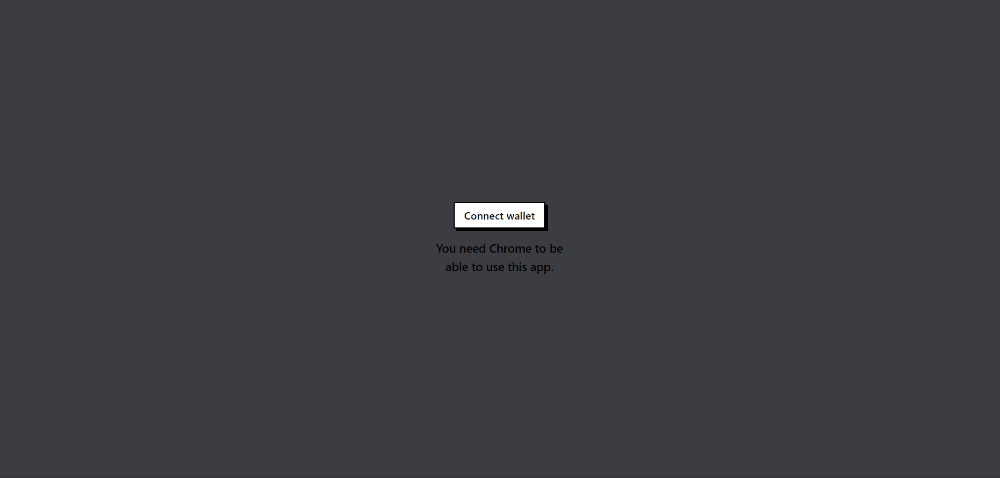

# Opensea Clone using #NextJs #Tailwind  #ThirwebSDK 

This is a personnal project [Tailwind CSS](https://tailwindcss.com/) with Next.js.
This project was made using #NextJs #Tailwind #ThirwebSDK #SanityIO

It includes a landing page and collection page listed on Georly Test network fetched from ThirdWeb marketplace module and NFT collection module.
Authentication is established with metamask.
## Responsive design

> Implementation




## Instructions

Execute [`create-next-app`](https://github.com/vercel/next.js/tree/canary/packages/create-next-app) with [npm](https://docs.npmjs.com/cli/init), [Yarn](https://yarnpkg.com/lang/en/docs/cli/create/), or [pnpm](https://pnpm.io) to bootstrap the example:

```bash
npx create-next-app --example with-tailwindcss with-tailwindcss-app
```


